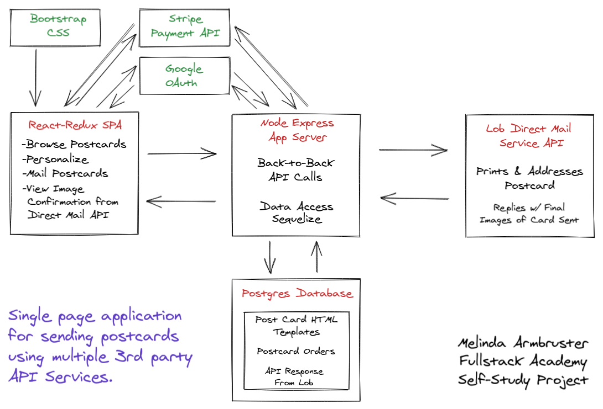

# Easycard 📬  
*A Fullstack SPA for Sending Personalized Postcards via Real Mail*

## Overview

**Easycard** is a mobile-first, single page application (SPA) for creating and sending customized postcards through real-world direct mail services. This project is designed, built, and maintained entirely by me — Melinda Armbruster — as part of my Fullstack Academy self-study capstone. I continue to evolve the app for potential commercial release.

This is a fully integrated, end-to-end application connecting a modern front-end, a Node.js backend, a PostgreSQL database, and multiple third-party APIs including Lob (for direct mail), Stripe (for payment processing), and Google OAuth (for authentication).

---

## Features

- 📸 **Browse & Customize Postcards**  
  A dynamic gallery allows users to select and personalize postcard templates using a responsive React/Redux interface.

- 💳 **Pay with Stripe**  
  Seamless payment flow through the Stripe API allows users to complete their order with a credit card.

- 📬 **Send Real Mail via Lob API**  
  The app integrates with the Lob Direct Mail API to send postcards to real mailing addresses. Users receive visual confirmation of the exact printed postcard.

- 🧠 **User Authentication with Google OAuth**  
  Google login provides a secure and user-friendly authentication mechanism.

- 🔄 **Fullstack Data Flow**  
  Efficient back-to-back API calls on the server coordinate the Stripe charge and Lob printing while storing postcard templates, orders, and API responses in a PostgreSQL database.

---

## Architecture

The application follows a service-oriented architecture with the following components:

- **React + Redux SPA (Frontend):**
  - Browse postcards
  - Personalize content and design
  - Initiate postcard mailing and payments
  - View final confirmation image of sent postcard
  - Responsive UI built with Bootstrap CSS

- **Node + Express App Server (Backend):**
  - Handles API orchestration (Lob, Stripe, Google)
  - Manages business logic and database communication
  - Uses Sequelize ORM for secure data access

- **PostgreSQL Database:**
  - Stores HTML postcard templates
  - Tracks orders and their status
  - Records responses from the Lob API

- **Third Party Services:**
  - **Lob API**: Prints and mails the postcard, provides confirmation image
  - **Stripe API**: Processes credit card payments
  - **Google OAuth**: Enables user login and session management

---

## Technologies Used

- **Frontend:** React, Redux, Bootstrap, JavaScript (ES6+)
- **Backend:** Node.js, Express.js, Sequelize ORM
- **Database:** PostgreSQL
- **Authentication:** Google OAuth
- **Payments:** Stripe API
- **Direct Mail Service:** Lob API
- **Architecture:** RESTful API design, SPA, MVC pattern

---

## Why Easycard?

- Demonstrates my ability to integrate third-party services in a production-ready architecture.
- Emphasizes thoughtful UX/UI design for non-technical users.
- Showcases fullstack development from database design to API management to frontend state handling.
- Built as a professional-grade portfolio project with real-world commercial potential.

---

## Diagram

The diagram above illustrates how Easycard brings together multiple technologies and services into a single cohesive experience, from user interaction to postcard delivery.

---

## About the Developer

👩‍💻 **Melinda Armbruster**  
Frontend-focused Fullstack Software Engineer  
3.5+ years of experience building customer-facing web applications  
Based in Tennessee | [LinkedIn](#) | [Portfolio](#)

---

## Future Enhancements

- Add user dashboard for managing previous orders
- Enable image uploads and rich text customization
- Build admin tools for template management
- International mailing support
- Optimize mobile layout further

## Local environment setup

Use Node.js 22 and npm 10 (tested with 22.18.0 / 10.9.3) and local
PostgreSQL (16.15). Copy `dev.env.example` to private root `dev.env` and fill
in local settings. The application and seed script load this file only when
`NODE_ENV` is absent or `development`; existing environment variables win.
Tests and production read only explicitly injected settings. `.env` is for
Compose interpolation and is never loaded by the application.

`DATABASE_URL` does not imply TLS. Leave `DATABASE_SSL=false` for the local
Unix socket and Chris's private Compose database. Set it to `true` only for a
TLS-enabled database with a trusted certificate. Production requires its own
`SESSION_SECRET`; never reuse the development secret.

Run `npm install`, then `npm run build-client` and `npm run start-dev`.
The project `.npmrc` retains legacy peer resolution for the original dependency
stack. Webpack remains on major 4 with a targeted Node 22 compatibility update.
Create the PostgreSQL database separately if absent. `npm run seed` **resets all
tables**; confirm the target and obtain approval first. It creates 3 demo users,
6 templates and 6 orders; failures now propagate to a nonzero exit status.
Startup creates missing tables without seeding or resetting them.

For tests, create a separate `easycard-test` database and explicitly inject
`DATABASE_URL=postgres:///easycard-test?host=/var/run/postgresql`,
`DATABASE_SSL=false`, a test-only `SESSION_SECRET`, and dummy test provider
settings (`STRIPE_SK=sk_test_placeholder`, `LOB_API_TEST_KEY=test_placeholder`).
Run `npm test`; the suite resets tables. Never point it at development or
production. Google credentials can be omitted for these automated tests.

### Provider and deployment handoff

The server uses `STRIPE_SK` and `LOB_API_TEST_KEY`; Lob remains in test mode.
Use sandbox credentials locally. The active browser Stripe publishable key is
in `client/components/OrderForm.js`; `client/index.js` has the same key in a
commented-out integration. Both are test-mode keys. `STRIPE_PK` is preserved in
the templates and Compose but does not configure the browser bundle. Changing
Stripe accounts requires confirming the matching publishable key and rebuilding
the client. Never include private keys in client code or webpack definitions.

Google's development callback must be registered with the intended OAuth client:
`http://localhost:1337/auth/google/callback`. Chris supplies the production
callback and provider settings separately. All supplied provider fields remain
in both templates and Compose, including `LOB_API_KEY` even though the server
uses only the test key.

Chris should use Node major 22 for the image build, include `.npmrc` during
installation, set `DATABASE_SSL=false` for the private database, and inject a
separate production session secret. Docker builds, ARM64 validation, publishing
and deployment are Chris's responsibility; local development requires no Docker.
Private `.env`, `dev.env`, `secrets.js` and backup files are excluded from Git
and the Docker build context. Retain private originals until their owner confirms
the settings are safely retained.

### Local validation (2026-09-26)

Validated with Node 22.18.0, npm 10.9.3 and PostgreSQL 16.15, using role
`melinda` and `/var/run/postgresql`. `npm install`, `npm run build-client`,
`npm run seed`, `npm run start-dev`, and `npm test` passed. All 13 tests ran
against the separately configured `easycard-test` database. Development seed
counts were verified: 3 users, 6 templates, 6 orders. No `secrets.js` was present.
The production and development bundles and source maps passed a local scan
against the supplied private credentials. Changed JavaScript lint checks had
no errors; existing seed/Lob naming and unused-variable warnings remain.

Headless Chrome checks passed for landing, the six-card gallery, login,
authenticated home/session persistence, registration/logout, and order-form
sender prefill. The temporary registration account was removed afterward.
The seeded login is `cody@email.com` / `123`; the existing login placeholder
mentions `demo@demo.com`, which the original seed does not create.

Google's redirect and localhost callback were checked, but interactive Google
consent and callback completion remain untested. Stripe test balance and Lob
test postcard-list requests both returned HTTP 200. No payment or postcard was
created; checkout, physical delivery, and final confirmation remain unverified.
Docker/ARM64/deployment checks were not performed. npm reported 120 dependency
vulnerabilities; broad dependency remediation remains outside this migration.
